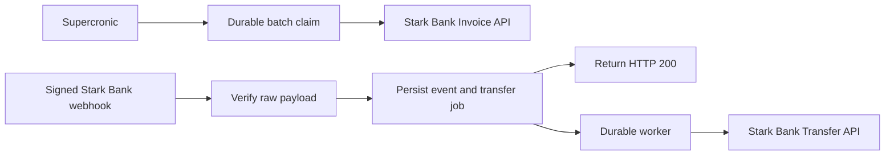

# Stark Bank Backend Developer Trial

A production-minded Flask integration for the Stark Bank Sandbox. It issues 8 to 12 Invoices
every three hours for 24 hours and, for each signed `invoice/credited` event, transfers the net
credited amount to the account required by the challenge.

The application uses Python 3.13, Flask 3.1, `starkbank==2.35.0`, PostgreSQL, Gunicorn,
Supercronic and Docker Compose. It deliberately does not need Kubernetes, Swarm, Redis or
Valkey for this workload.

## Evaluate it

There are two independent environments. Neither reads configuration from the other.

| Path | Purpose | Configuration |
| --- | --- | --- |
| Deployed application | Inspect the already-running trial over HTTPS or temporary SSH | `compose.vps.yaml`, `/etc/starkbank-trial`, GitHub Environment |
| Evaluator's computer | Clone and run a disposable copy | `compose.yaml`, `.env`, `secrets/private-key.pem` |

After the VPS is activated, its public checks are:

```bash
curl --fail https://159.223.160.99/health/ready
ssh reviewer@159.223.160.99
sudo make -C /opt/starkbank-trial vps-status
sudo make -C /opt/starkbank-trial vps-trial-status
```

The temporary SSH account is enabled only for the review window. See
[`docs/VPS_REVIEW.md`](docs/VPS_REVIEW.md) for safe inspection commands and the explicit sudo
security boundary.

The production webhook endpoint is `https://159.223.160.99/webhooks/starkbank`. Caddy obtains a
public short-lived certificate for that IPv4 address and renews it automatically.
The Sandbox Workspace is configured through the non-secret `STARKBANK_WORKSPACE_ID` and is
checked after signature verification, before any event is persisted.

To run an independent local copy:

```bash
git clone https://github.com/GleisonEm/starkbank-backend-challenge.git
cd starkbank-backend-challenge
cp .env.example .env
mkdir -p secrets
cp /path/to/private-key.pem secrets/private-key.pem

# Edit .env, including a non-default database password and Sandbox Project ID.
make build
make up
make health
make test
```

## Manual image publication

The evaluator does not need registry credentials to run the local stack. If you need to publish
an amd64 image manually, log in through Docker's credential helper and publish only from a clean
commit:

```bash
docker login docker.io
make image-push CONFIRM_PUSH=yes
```

The command prints the immutable digest returned by the registry. Never put a Docker Hub token in
`.env`, a workflow file, the repository, an image layer or a command argument. A reviewer can use
their own Docker credentials, or pull the public image by digest when the repository is public.

`make build`, `make up` and every unprefixed lifecycle command always target local Docker.
`make test` is Docker-only, creates an isolated test database and requires no Stark Bank
credentials. No build, test or startup command creates Invoices, Webhooks or Transfers.

## Reliability design



- A trial persists exactly eight batches at hours 0, 3, 6, 9, 12, 15, 18 and 21.
- Database leases, locks and deterministic Invoice tags tolerate scheduler overlap and timeouts.
- The webhook validates `Digital-Signature` against the exact raw request body before parsing.
- Event IDs, Invoice IDs and stable Transfer `external_id` values make retries idempotent.
- Transfer creation runs outside the request and reconciles unknown outcomes before retrying.
- Money is integer cents. A non-positive `received_amount - fee` is audited and never sent.
- JSON logs are persisted, but payloads, signatures, keys, payer data and recipient data are not.

## Local webhook tunnel

The optional local tunnel runs from the official `cloudflared` image and needs no account, token
or host installation:

```bash
make tunnel
make tunnel-url
```

Copy the generated HTTPS URL to `PUBLIC_BASE_URL` in `.env`, explicitly enable live Sandbox
operations, then create the webhook:

```bash
make sandbox-check
make webhook-setup
make webhook-cleanup CONFIRM_SANDBOX=yes
make smoke-invoice CONFIRM_SANDBOX=yes
make smoke-batch COUNT=8 CONFIRM_SANDBOX=yes
```

On the VPS, use `sudo make vps-live-enable CONFIRM_SANDBOX=yes` only for the validation window,
`sudo make vps-live-disable` as the emergency stop, then `sudo make vps-smoke-batch COUNT=8
CONFIRM_SANDBOX=yes`. The accelerated batch is idempotent by `REFERENCE` and does not replace the
official eight-slot, 24-hour schedule started with `sudo make vps-trial-start CONFIRM_SANDBOX=yes`.

Cloudflare documents Quick Tunnels as development-only, random `trycloudflare.com` endpoints
without an uptime SLA. They are never used by the VPS. Ngrok is documented only as an
account/token-based alternative.

## Documentation

- [`docs/LOCAL.md`](docs/LOCAL.md): local setup, Docker, Quick Tunnel and troubleshooting
- [`docs/SANDBOX.md`](docs/SANDBOX.md): Webhook, smoke Invoice and 24-hour execution
- [`docs/VPS.md`](docs/VPS.md): manual VPS installation and independent production configuration
- [`docs/VPS_REVIEW.md`](docs/VPS_REVIEW.md): evaluator SSH inspection guide
- [`docs/OPERATIONS.md`](docs/OPERATIONS.md): deploy, logs, backup, restore and rollback
- [`docs/EVIDENCE.md`](docs/EVIDENCE.md): redacted release, smoke and trial evidence
- [`SECURITY.md`](SECURITY.md): secrets, hardening, sudo exposure and revocation
- [`RESEARCH.md`](RESEARCH.md): SDK compatibility and technical research
